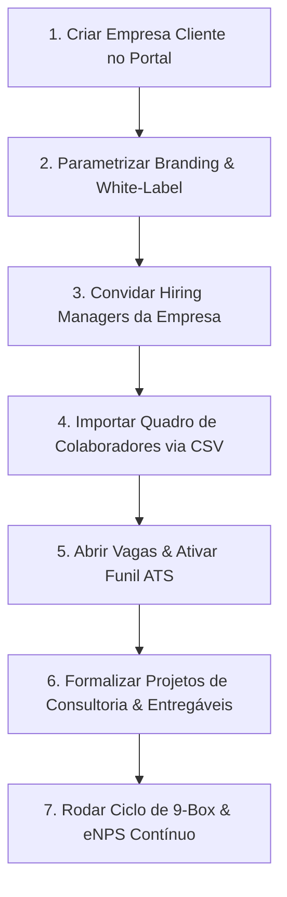

# 📖 Manual Operacional de Migração & Onboarding de Clientes
**Plataforma Maître Conecta — Guia Passo a Passo para Consultores e Gestores de RH**  
*Versão:* 1.0 — 2026  
*Público-Alvo:* Consultores Maître, Tech Recruiters, Hiring Managers e Gestores de RH/DP de Empresas Clientes

---

## 🎯 Objetivo deste Manual

Este guia orienta a equipe da **Maître Consultoria** e os gestores de RH das empresas parceiras no processo de **onboarding, parametrização e migração segura de dados** para o ecossistema **Maître Conecta**.

---

## 🚀 Passo a Passo da Migração de um Novo Cliente

---

### ETAPA 1: Cadastro da Empresa Cliente Parceira
1. Acesse o menu lateral e clique em **Empresas Clientes** (`/clients`).
2. Clique no botão **"+ Nova Empresa Cliente"**.
3. Preencha os dados institucionais:
   - **Nome Fantasia:** Nome da empresa cliente (ex: *Acme Corporation*).
   - **Slug Exclusivo:** Identificador único para a URL pública (ex: `acme-corp`).
   - O sistema gera automaticamente a URL do portal de carreiras:  
     `https://maitreconecta.vercel.app/carreiras/acme-corp`
4. Clique em **"Cadastrar Empresa"**.

---

### ETAPA 2: Parametrização White-Label & Dados Fiscais
1. Na lista de clientes (`/clients`), localize o card da empresa e clique em **"Detalhes"** para acessar a página 360° (`/clients/[id]`).
2. Na aba **"Dados Institucionais & White-Label"**, clique em **"Editar Informações"**:
   - **CNPJ e Razão Social:** Dados cadastrais para faturamento e contratos.
   - **Cor Primária da Marca:** Código HEX da marca do cliente (ex: `#2563eb`).
   - **Headline do Portal:** Frase de boas-vindas do portal de carreiras (ex: *"Construa o futuro da tecnologia conosco"*).
   - **Logo Institucional:** Link ou upload da imagem da logomarca.
3. Salve as alterações. O portal público e os e-mails transacionais adotarão automaticamente a identidade da empresa parceira.

---

### ETAPA 3: Convite aos Gestores (Hiring Managers)
1. Na página 360° do cliente (`/clients/[id]`), acerte a aba **"Equipe & Gestores"**.
2. Clique no botão **"Convidar Gestor"**:
   - Informe o **Nome** e **E-mail Corporativo** do gestor da empresa parceira.
   - Uma senha temporária segura padrão (`Maitre@2026`) será gerada.
3. Clique em **"Enviar Convite"**:
   - O sistema enviará automaticamente um **e-mail transacional formatado** ao gestor com as credenciais e o link direto para o **Portal do Gestor** (`/portal-gestor`).
   - Pelo portal, o gestor poderá acompanhar candidatos triados, laudos de Fit 3D, aprovar propostas de contratação e dar feedbacks.

---

### ETAPA 4: Migração em Lote do Quadro de Colaboradores (CSV)
Para clientes que já possuem colaboradores ativos e desejam centralizar o Core HR no Maître Conecta:

1. Acesse o menu **Conecta Pessoas** (`/employees`).
2. Clique no botão **"📥 Importar em Lote (CSV)"**.
3. Selecione a **Empresa Cliente de Destino**.
4. Estruture a planilha do cliente de acordo com as colunas recomendadas:

| Coluna Recomendada | Tipo | Exemplo | Observação |
|---|---|---|---|
| **Nome Completo** | Texto | `Carlos Eduardo Ribeiro` | Obrigatório |
| **E-mail** | E-mail | `carlos.ribeiro@cliente.com` | Obrigatório (chave única) |
| **Cargo** | Texto | `Engenheiro de Software Sênior` | Criado automaticamente se não existir |
| **Departamento** | Texto | `Tecnologia` | Criado automaticamente se não existir |
| **Matrícula** | Código | `ACME-2026-001` | Gerado automaticamente se vazio |
| **CPF** | Documento | `123.456.789-00` | Sanitizado para auditoria |
| **Salário** | Numérico | `16500` | Salário bruto mensal acordado |
| **Regime** | Sigla | `CLT` ou `PJ` | Padrão `CLT` |

5. Cole o conteúdo no campo de texto ou utilize o botão **"Colar Modelo de Exemplo"** para validar a formatação.
6. Clique em **"Executar Importação em Lote"**:
   - O sistema criará todos os setores e cargos inexistentes.
   - Criará os registros formais em `Employee` e `Candidate`.
   - Um resumo exibirá o número exato de colaboradores migrados com sucesso.

---

### ETAPA 5: Abertura de Vagas & Ativação do Funil (Conecta Talentos)
1. Acesse **Vagas** (`/jobs`) e clique em **"Nova Vaga"**.
2. Selecione a empresa cliente parceira.
3. Defina o título da vaga, departamento, faixa salarial, requisitos de Fit Cultural e etapas personalizadas do funil Kanban.
4. Ao publicar, a vaga fica imediatamente visível no portal público do cliente (`/carreiras/[slug]`) e integrada ao Kanban com movimentação de cards em tempo real.

---

### ETAPA 6: Formalização de Projetos no Conecta Consultoria
Para serviços especializados prestados pela Maître (Hunting Executivo, Cargos & Salários, Diagnóstico de Clima ou DHO):

1. Acesse **Conecta Consultoria** (`/consulting`).
2. Clique em **"Novo Projeto de Consultoria"**.
3. Selecione a empresa cliente atendida.
4. Escolha a especialidade:
   - *Hunting Executivo*
   - *Cargos & Salários*
   - *Diagnóstico de Clima & DHO*
   - *Mentoria de Liderança*
   - *Governança de RH*
5. Defina o consultor responsável da Maître (ex: *Adriana, Erika, Pedro, Lauriana, Kheviany*), honorários contratuais e data prevista.
6. Ao salvar, os marcos metodológicos oficiais da Maître são gerados automaticamente e a empresa cliente poderá acompanhar o avanço percentual e os relatórios diretamente na sua página 360°.

---

### ETAPA 7: Ativação dos Ciclos de Desenvolvimento & Clima
1. **Conecta Desenvolvimento (`/development`):**
   - Os colaboradores importados na Etapa 4 já aparecem na **Matriz 9-Box**.
   - Os consultores e gestores podem atribuir notas de Desempenho e Potencial e traçar **Planos de Desenvolvimento Individual (PDI)**.
2. **Conecta Cultura (`/culture`):**
   - Selecione a empresa cliente no topo.
   - Lance um novo ciclo de pesquisa de clima com eNPS.
   - Acompanhe o índice de favorabilidade por área em tempo real.
3. **Conecta Aprendizagem (`/learning`):**
   - Atribua trilhas obrigatórias de Onboarding ou Liderança para os admitidos.

---

## ✅ Checklist de Homologação da Migração

- [ ] Empresa cadastrada com CNPJ, logo e cor primária.
- [ ] Pelo menos 1 Hiring Manager convidado e testado no `/portal-gestor`.
- [ ] Quadro de colaboradores migrado via CSV e validado em `/employees`.
- [ ] Vagas abertas conferidas no portal público `/carreiras/[slug]`.
- [ ] Projeto de consultoria e entregáveis cadastrados em `/consulting`.
- [ ] Colaboradores conferidos na Matriz 9-Box em `/development`.
- [ ] Log de auditoria verificado em conformidade com as normas LGPD.

---
*Maître Consultoria — Inteligência Executiva & Gestão Estratégica de Pessoas.*
