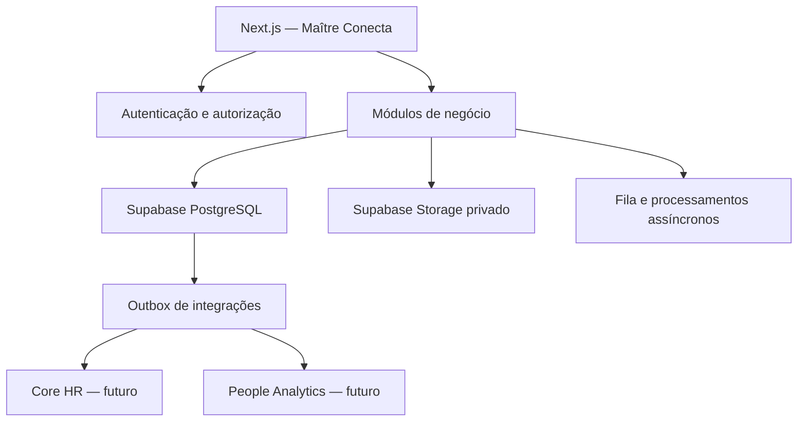
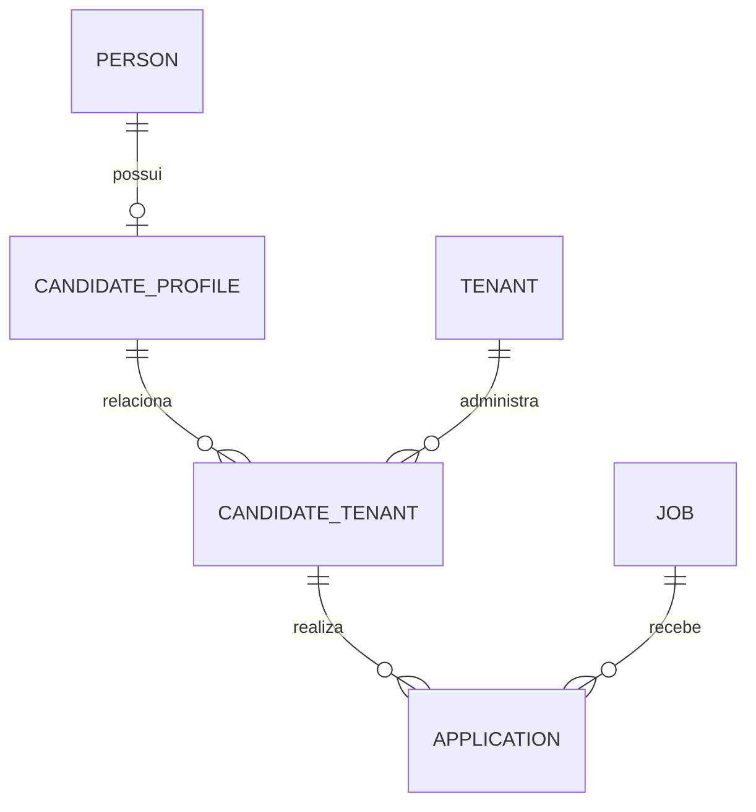
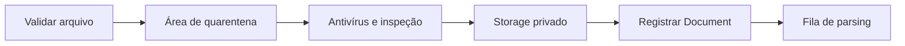
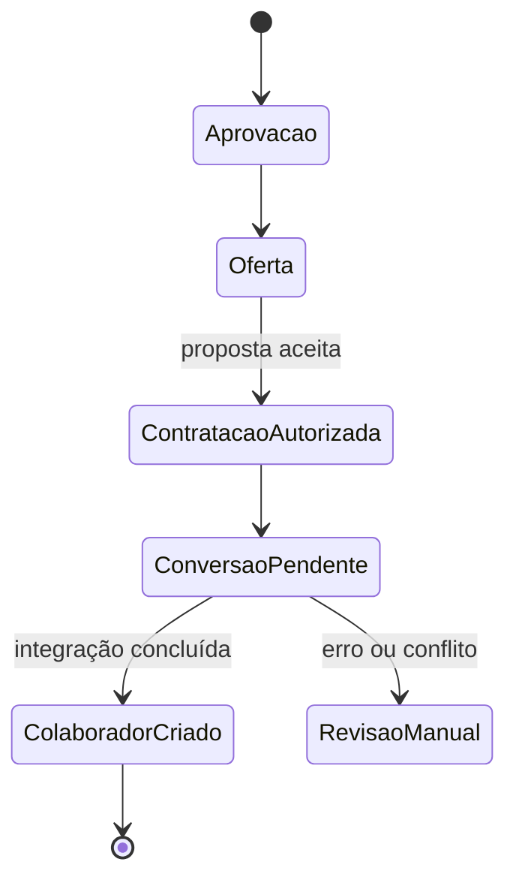

# Plano de Evolução do ATS para o Maître Conecta

> Documento técnico de recomendações para evolução do ATS existente e sua integração futura ao ecossistema Maître Conecta.

**Versão:** 1.0  
**Data:** 25 de agosto de 2026  
**Stack atual considerada:** Next.js, React, TypeScript, Supabase/PostgreSQL, Prisma, Vercel e GitHub  
**Classificação atual:** MVP aprovado, com reforços obrigatórios de segurança, privacidade e arquitetura antes da expansão para DHO e DP.

---

## 1. Objetivo deste documento

Este documento consolida as alterações recomendadas após a análise da arquitetura documentada do ATS da Maître Consultoria. O objetivo é preservar o que já foi construído, corrigir riscos críticos e preparar o sistema para se tornar o módulo de Atração e Seleção do **Maître Conecta**.

O direcionamento principal é:

- não reconstruir o ATS do zero;
- evoluí-lo como o módulo **Conecta Talentos**;
- manter inicialmente um monólito modular;
- fortalecer o isolamento entre clientes;
- proteger currículos e demais dados pessoais;
- preparar uma integração segura com Core HR, DHO e DP;
- criar rastreabilidade suficiente para LGPD, auditoria e decisões apoiadas por IA.

> **Limite da análise:** as recomendações foram elaboradas a partir do arquivo `ARQUITETURA.md`. Antes de qualquer liberação para produção em escala, deverá ser realizada também uma auditoria do código-fonte, das migrations, das policies RLS, dos ambientes da Vercel e das configurações do Supabase.

---

## 2. Diagnóstico executivo

### 2.1 Pontos positivos da estrutura atual

A base tecnológica é adequada para o estágio atual do produto:

- Next.js, React e TypeScript formam uma stack produtiva e bem integrada à Vercel;
- Supabase/PostgreSQL atende ao modelo relacional e ao crescimento inicial do produto;
- Prisma facilita a modelagem, as migrations e o acesso tipado ao banco;
- a separação entre `Candidate` e `Application` é conceitualmente correta;
- etapas configuráveis permitem adaptar o processo seletivo de cada cliente;
- portal público, pipeline visual e avaliações já formam um ATS funcional;
- o parser heurístico como alternativa à IA reduz indisponibilidade do fluxo;
- a estrutura pode receber a ação de **Contratar** e criar o vínculo com o futuro Core HR;
- a aplicação pode continuar hospedada em GitHub, Supabase e Vercel durante a fase inicial.

### 2.2 Principais riscos identificados

| Prioridade | Risco | Impacto potencial | Alteração recomendada |
|---|---|---|---|
| P0 | Bucket público para currículos | Exposição de dados pessoais e documentos | Bucket privado, RLS e URLs assinadas de curta duração |
| P0 | Fallback para `/public/uploads/resumes/` | Arquivos públicos, perda de arquivos e inconsistência | Remover completamente o armazenamento local |
| P0 | Três destinos de armazenamento sem fonte canônica | Dados órfãos e comportamento imprevisível | Adotar um único storage oficial e retentativas controladas |
| P0 | Isolamento multiempresa insuficiente | Um cliente pode acessar dados de outro | `tenant_id`, RLS, autorização no servidor e testes de isolamento |
| P0 | Autorização concentrada no Proxy/JWT | IDOR/BOLA e acesso indevido a operações internas | Revalidar usuário, tenant e permissão em toda operação sensível |
| P0 | E-mail de candidato globalmente único | Mistura indevida de candidatos entre clientes | Separar pessoa, perfil e relacionamento com cada tenant |
| P0 | `Activity` utilizada como auditoria | Ausência de trilha técnica confiável | Criar `AuditEvent` imutável e separado da timeline de negócio |
| P0 | IA processando currículos sem governança formal | Risco de privacidade, vieses e decisões sem explicação | Minimização de PII, versionamento, revisão humana e logs |
| P1 | Ausência de histórico transacional de etapas | Perda da história do pipeline | Criar `ApplicationStageTransition` |
| P1 | Entidades essenciais ainda ausentes | Fluxo seletivo incompleto | Entrevistas, scorecards, propostas, consentimentos e conversão |
| P1 | Modelagem inadequada de valores e campos JSON | Erros de cálculo e consultas lentas | `NUMERIC`, `JSONB`, constraints e índices adequados |
| P1 | Falta de eventos de integração | Acoplamento futuro entre ATS, DHO e DP | Outbox transacional e eventos versionados |

---

## 3. Arquitetura-alvo recomendada

O ATS deve evoluir como um **monólito modular**, implantado na Vercel e utilizando o Supabase como banco e armazenamento principal. Microsserviços não são necessários neste momento: aumentariam custo operacional, observabilidade, autenticação distribuída e complexidade de deploy sem benefício proporcional.



### 3.1 Organização sugerida do código

```text
src/
├── modules/
│   ├── identity/
│   ├── tenancy/
│   ├── recruiting/
│   ├── candidates/
│   ├── applications/
│   ├── interviews/
│   ├── offers/
│   ├── documents/
│   ├── matching/
│   ├── privacy/
│   ├── audit/
│   └── integrations/
├── shared/
│   ├── auth/
│   ├── database/
│   ├── storage/
│   ├── events/
│   └── validation/
└── app/
```

Cada módulo deve possuir, conforme a necessidade:

- tipos e schemas de validação;
- casos de uso ou serviços;
- repositórios de acesso a dados;
- políticas de autorização;
- eventos de domínio;
- testes unitários e de integração;
- componentes de interface específicos do módulo.

As páginas e Route Handlers não devem conter diretamente toda a regra de negócio. Eles devem validar a entrada, identificar o contexto do usuário e chamar os casos de uso correspondentes.

---

## 4. Multiempresa e isolamento de clientes

O Maître Conecta será um sistema SaaS multiempresa. Portanto, **o isolamento de tenants deve existir desde o banco de dados até a interface**.

### 4.1 Identificador do cliente

Utilizar `tenant_id` como chave de isolamento em todas as tabelas pertencentes a um cliente. A organização comercial pode continuar sendo representada por `Organization`, mas o conceito técnico deve ser consistente em todo o sistema.

Tabelas que devem conter `tenant_id`, direta ou indiretamente:

- `job`;
- `stage`;
- `candidate_tenant`;
- `application`;
- `application_stage_transition`;
- `evaluation`;
- `activity`;
- `interview`;
- `scorecard`;
- `offer`;
- `document`;
- `candidate_consent`;
- `audit_event`;
- `hire_conversion`;
- `integration_outbox`.

### 4.2 Row Level Security

Ativar RLS nas tabelas expostas pelo Data API do Supabase. Cada policy deve conferir simultaneamente:

1. que o usuário está autenticado;
2. que possui associação ativa com o tenant;
3. que a linha pertence ao mesmo tenant;
4. que sua função permite a operação solicitada;
5. quando aplicável, que seu escopo organizacional permite acessar aquela vaga, unidade ou departamento.

Uma policy genérica apenas com `TO authenticated` não é suficiente.

### 4.3 Defesa em profundidade

O isolamento não deve depender exclusivamente de RLS. A aplicação deverá:

- obter o tenant a partir de uma associação válida do usuário;
- nunca confiar em um `tenant_id` enviado livremente pelo navegador;
- filtrar consultas por tenant no servidor;
- validar o recurso carregado antes de alterar ou excluir;
- registrar tentativas de acesso negado;
- testar acesso cruzado entre clientes em integração e CI.

### 4.4 Índices multiempresa

Os índices compostos mais usados devem começar por `tenant_id`. Exemplos:

```sql
CREATE INDEX idx_application_tenant_job_stage
ON application (tenant_id, job_id, current_stage_id);

CREATE INDEX idx_candidate_tenant_email
ON candidate_tenant (tenant_id, normalized_email);

CREATE INDEX idx_audit_event_tenant_created
ON audit_event (tenant_id, created_at DESC);
```

Constraints únicas também devem respeitar o tenant, por exemplo:

```sql
UNIQUE (tenant_id, job_slug)
UNIQUE (tenant_id, normalized_email)
UNIQUE (tenant_id, application_id, evaluation_cycle_id)
```

---

## 5. Identidade, papéis e permissões

### 5.1 Estrutura recomendada

Substituir o papel global associado diretamente ao usuário por uma estrutura baseada em vínculo:

- `User`: identidade de acesso;
- `OrganizationMembership`: vínculo do usuário com uma empresa;
- `Role`: papel exercido naquele tenant;
- `Permission`: capacidade específica;
- `MembershipScope`: restrição opcional por unidade, departamento, vaga ou equipe.

Um mesmo usuário poderá, por exemplo, ser administrador em uma empresa e avaliador convidado em outra.

### 5.2 Matriz inicial de permissões

| Papel | Escopo sugerido |
|---|---|
| Administrador do cliente | Configura empresa, usuários, vagas, etapas e relatórios do próprio tenant |
| Recrutador | Gerencia vagas e candidaturas autorizadas |
| Gestor requisitante | Consulta e avalia candidatos de suas vagas |
| Avaliador | Preenche scorecards específicos, sem acesso administrativo |
| Candidato | Acessa apenas seus próprios dados, candidaturas e solicitações |
| Consultor Maître | Atua somente nos clientes formalmente atribuídos |
| Suporte privilegiado | Acesso temporário, justificado, auditado e com MFA |

### 5.3 Superadministrador

O perfil `SUPER_ADMIN` não deve ser usado nas atividades comuns. Recomenda-se um mecanismo de acesso emergencial ou temporário com:

- MFA obrigatório;
- justificativa registrada;
- duração curta;
- cliente e escopo selecionados;
- notificação ou aprovação quando aplicável;
- auditoria integral das ações;
- revogação automática ao final do período.

### 5.4 JWT, Proxy e operações no servidor

Claims do JWT podem ser utilizados para otimizar a experiência da interface, mas não devem ser a única fonte de autorização, pois podem ficar desatualizados após revogação ou mudança de função.

Toda Server Action, Route Handler ou serviço sensível deve:

1. validar a sessão;
2. verificar se o vínculo com o tenant continua ativo;
3. consultar a permissão necessária;
4. validar a posse ou o escopo do recurso;
5. executar a operação;
6. registrar auditoria quando necessário.

O Proxy ou middleware deve ser tratado como uma primeira barreira, não como o mecanismo definitivo de segurança.

---

## 6. Reestruturação do modelo de candidatos

O e-mail do candidato não deve ser único globalmente no sistema. Isso pode unir indevidamente relações que pertencem a clientes diferentes e cria conflitos com duplicidades reais, mudanças de e-mail ou candidaturas realizadas com endereços distintos.

### 6.1 Modelo recomendado



- `Person`: identidade mínima de uma pessoa, usada futuramente pelo Core HR;
- `CandidateProfile`: informações profissionais do candidato;
- `CandidateTenant`: relacionamento e finalidade do uso dos dados em cada cliente;
- `Application`: candidatura a uma vaga específica.

### 6.2 Campos essenciais de `CandidateTenant`

```text
id
tenant_id
candidate_profile_id
source
visibility
legal_basis
privacy_notice_version
retention_until
talent_pool_status
normalized_email
created_at
updated_at
deleted_at
```

### 6.3 Banco de talentos central da Maître

Um banco de talentos compartilhado não deve surgir automaticamente pela soma dos bancos de cada cliente. Caso a Maître queira manter um banco central, ele precisa ter:

- finalidade própria e claramente comunicada;
- base legal correspondente;
- aviso de privacidade específico;
- controle de visibilidade;
- prazo de retenção;
- possibilidade de revogação ou oposição, conforme aplicável;
- rastreabilidade de qual cliente pode visualizar cada perfil.

---

## 7. Entidades que devem ser adicionadas

| Entidade | Finalidade |
|---|---|
| `Interview` | Agendamento, formato, participantes, status e resultado da entrevista |
| `InterviewParticipant` | Relação entre entrevista e avaliadores |
| `Scorecard` | Critérios padronizados e notas de avaliação |
| `Offer` | Proposta, valores, condições, status e validade |
| `OfferApproval` | Fluxo de aprovação interna da proposta |
| `RejectionReason` | Motivo estruturado e autorizado de reprovação |
| `ApplicationStageTransition` | Histórico completo de movimentações no pipeline |
| `CandidateMerge` | Registro seguro de deduplicação de perfis |
| `CandidateConsent` | Consentimentos quando esta for a base aplicável |
| `PrivacyNoticeVersion` | Versionamento dos avisos apresentados ao titular |
| `DataSubjectRequest` | Solicitações LGPD de acesso, correção, oposição ou eliminação |
| `RetentionPolicy` | Regras de retenção por categoria, finalidade e tenant |
| `Document` | Metadados e ciclo de vida de currículos e anexos |
| `AuditEvent` | Trilha técnica imutável de segurança e alterações sensíveis |
| `HireConversion` | Conversão controlada de candidato em colaborador |
| `IntegrationOutbox` | Eventos confiáveis destinados a outros módulos |

---

## 8. Histórico do pipeline seletivo

A aplicação deve guardar o estágio atual para leitura rápida e também todas as transições para histórico.

### 8.1 Estrutura de `ApplicationStageTransition`

```text
id
tenant_id
application_id
from_stage_id
to_stage_id
changed_by
reason
changed_at
correlation_id
```

### 8.2 Regra transacional

Ao mover um cartão no Kanban, as seguintes ações devem ocorrer na mesma transação:

1. validar o tenant, a permissão e o estado atual;
2. inserir a transição;
3. atualizar o estágio atual da candidatura;
4. criar a atividade de negócio;
5. criar o evento de auditoria;
6. publicar um evento na outbox, se houver integração interessada.

Se qualquer passo crítico falhar, a movimentação não deve ser concluída parcialmente.

Para movimentos concorrentes, usar controle otimista por versão ou atualização condicional, evitando que dois recrutadores sobrescrevam silenciosamente a decisão um do outro.

---

## 9. Currículos, anexos e armazenamento

### 9.1 Alteração obrigatória

Todos os currículos e documentos devem ficar em um bucket privado do Supabase Storage. O acesso deve ocorrer por URL assinada com duração curta ou por endpoint autenticado que faça a verificação de permissão.

Remover:

- bucket público para currículos;
- persistência em `/public/uploads/resumes/`;
- fallback silencioso para Vercel Blob ou filesystem local;
- URL permanente de leitura pública;
- nomes de arquivos contendo dados pessoais sem necessidade.

### 9.2 Fonte canônica

Definir o Supabase Storage privado como fonte canônica inicial. Em caso de falha:

- registrar o erro;
- manter a operação com status `pending` ou `failed`;
- executar nova tentativa idempotente;
- alertar a equipe quando as tentativas se esgotarem;
- não trocar de provedor de forma invisível.

Se outro provedor for adotado no futuro, a escolha deve ser explícita, configurada por ambiente e registrada no objeto `Document`.

### 9.3 Entidade `Document`

Campos recomendados:

```text
id
tenant_id
candidate_profile_id
application_id
provider
bucket
storage_key
original_name
mime_type
size_bytes
checksum
malware_scan_status
classification
retention_until
created_by
created_at
deleted_at
```

### 9.4 Fluxo seguro de upload



O fluxo deverá conferir:

- tamanho máximo;
- extensões autorizadas;
- MIME real por inspeção de conteúdo;
- arquivo malformado ou protegido;
- malware;
- PDFs excessivamente complexos ou compactados;
- checksum para idempotência e detecção de duplicidade;
- necessidade de OCR para documentos digitalizados;
- classificação e prazo de retenção.

---

## 10. Governança do Fit 3D e uso de inteligência artificial

O Fit 3D deve apoiar o recrutador, não decidir sozinho pela eliminação de uma pessoa. Toda recomendação precisa ser explicável, versionada e sujeita à revisão humana.

### 10.1 Campos recomendados para cada processamento

```text
algorithm_version
prompt_version
model_provider
model_name
evaluated_at
salary_score
skills_score
knockout_results
final_score
explanation
input_snapshot
manual_override
override_reason
reviewed_by
reviewed_at
```

### 10.2 Regras de negócio configuráveis

O limite atual de 15% para aderência salarial não deve ficar fixo no código. Torná-lo configurável por tenant, vaga ou política, mantendo:

- valor utilizado no momento do cálculo;
- versão da regra;
- explicação do resultado;
- histórico quando a regra mudar.

O mesmo vale para pesos de competências, critérios eliminatórios e faixas de pontuação.

### 10.3 Proteção de dados no processamento por IA

Antes de enviar um currículo para um serviço de IA:

- remover CPF, endereço completo e outros identificadores desnecessários;
- enviar somente os dados necessários à finalidade;
- registrar provedor, modelo, versão, data e finalidade;
- verificar os termos de tratamento e retenção do fornecedor;
- impedir que uma reanálise sobrescreva silenciosamente o resultado anterior;
- permitir revisão, justificativa e correção humana;
- monitorar discrepâncias e possíveis vieses.

Dados sensíveis e atributos protegidos não devem ser utilizados como critérios de recomendação ou reprovação.

### 10.4 Falhas e fallback

O parser heurístico é útil como contingência, mas o sistema deve registrar qual mecanismo produziu cada resultado. Os resultados de IA e heurística não devem aparentar o mesmo nível de precisão sem identificação.

Estados sugeridos:

- `queued`;
- `processing`;
- `completed_ai`;
- `completed_heuristic`;
- `needs_review`;
- `failed`.

---

## 11. LGPD, retenção e direitos dos titulares

### 11.1 Inventário e finalidade

Cada categoria de dado deve possuir:

- finalidade;
- base legal;
- origem;
- responsáveis pelo acesso;
- prazo de retenção;
- destino após o término do prazo;
- fornecedores que recebem o dado;
- procedimento de atendimento ao titular.

### 11.2 Retenção

Implementar `RetentionPolicy` por tipo de dado e finalidade. A expiração deve gerar um fluxo controlado de:

1. identificação dos registros vencidos;
2. verificação de exceções legais ou contratuais;
3. anonimização ou exclusão;
4. remoção dos arquivos no storage;
5. registro auditável do procedimento, sem reter indevidamente o conteúdo eliminado.

### 11.3 Solicitações dos titulares

Criar `DataSubjectRequest` para acompanhar:

- confirmação e acesso;
- correção;
- portabilidade quando aplicável;
- informação sobre compartilhamento;
- revogação de consentimento;
- oposição;
- anonimização, bloqueio ou eliminação;
- revisão de decisão automatizada, quando aplicável.

O atendimento deve considerar todos os locais: banco, storage, logs permitidos, backups e serviços terceiros.

### 11.4 Segredos e dados privilegiados

- Nunca disponibilizar `service_role` no cliente.
- Manter segredos apenas em variáveis protegidas do ambiente.
- Separar chaves de desenvolvimento, homologação e produção.
- Rotacionar credenciais periodicamente e após incidentes.
- Não armazenar permissões confiáveis em metadados que o usuário possa editar.

> As configurações técnicas apoiam a conformidade, mas não substituem a validação jurídica das bases legais, avisos, contratos e prazos aplicáveis à operação da Maître e de cada cliente.

---

## 12. Auditoria e observabilidade

`Activity` deve continuar como timeline funcional, visível aos usuários autorizados. Auditoria de segurança deve ser armazenada em entidade separada e preferencialmente append-only.

### 12.1 Estrutura de `AuditEvent`

```text
id
tenant_id
actor_user_id
actor_membership_id
action
resource_type
resource_id
before_data
after_data
ip_address
user_agent
request_id
correlation_id
reason
created_at
```

### 12.2 Eventos prioritários para auditoria

- login, logout, falhas e bloqueios;
- alteração de papéis ou permissões;
- visualização ou download de currículo;
- exportação de candidatos;
- alteração de notas e avaliações;
- mudança de etapa;
- rejeição e contratação;
- fusão de candidatos;
- alteração de regras do Fit 3D;
- acesso privilegiado;
- exclusão, anonimização ou atendimento LGPD;
- alteração de configurações de integração.

### 12.3 Proteção dos logs

- impedir alteração comum pela aplicação;
- limitar acesso aos perfis autorizados;
- não registrar senhas, tokens ou currículo completo;
- definir retenção adequada;
- gerar alertas para exportações em massa, falhas repetidas e acesso entre tenants.

---

## 13. Banco de dados e Prisma

### 13.1 Tipos de dados

- usar `NUMERIC`/`DECIMAL` para salário e valores financeiros, nunca `FLOAT`;
- guardar moeda, periodicidade e faixa salarial separadamente;
- usar `TIMESTAMPTZ` para datas e horários relevantes;
- armazenar tags e estruturas consultáveis como `JSONB`, não como texto contendo JSON;
- utilizar enums ou tabelas de domínio para estados controlados;
- adicionar `CHECK` constraints para valores e transições inválidas;
- usar exclusão lógica apenas onde houver finalidade clara e política de retenção compatível.

### 13.2 Índices

Criar índices para:

- todas as chaves estrangeiras usadas em joins e exclusões;
- colunas utilizadas pelas policies RLS;
- combinações frequentes iniciadas por `tenant_id`;
- busca por estágio, vaga, status e data;
- expressões normalizadas de e-mail ou documento;
- campos `JSONB` consultados, utilizando GIN ou índices de expressão quando adequado.

Todo índice deve ser validado com consultas reais e `EXPLAIN ANALYZE`, evitando indexação indiscriminada.

### 13.3 Conexões serverless

Configurar conexão compatível com o ambiente serverless:

- URL com pooler para a aplicação;
- URL direta para migrations e operações administrativas;
- limites de conexão coerentes com Supabase e Vercel;
- Prisma Client instanciado de forma segura para evitar excesso de conexões;
- migrations executadas no processo de CI/CD, com estratégia de rollback ou correção.

Variáveis normalmente separadas:

```text
DATABASE_URL   -> conexão da aplicação via pooler
DIRECT_URL     -> conexão direta para migrations
```

---

## 14. Integração futura com Core HR, DHO e DP

O ATS não deve gravar diretamente em tabelas internas de outros módulos. A ação **Contratar** deve produzir uma conversão rastreável e um evento de integração.

### 14.1 Fluxo recomendado



### 14.2 Evento inicial sugerido

```text
candidate.hire_authorized.v1
```

Conteúdo mínimo:

- `event_id`;
- `tenant_id`;
- `candidate_profile_id`;
- `application_id`;
- `job_id`;
- `offer_id`;
- `authorized_by`;
- `occurred_at`;
- versão do schema;
- dados mínimos necessários para o Core HR.

### 14.3 Outbox transacional

O registro de `HireConversion` e o evento `IntegrationOutbox` devem ser gravados na mesma transação. Um processador assíncrono publica o evento e registra tentativas. Isso evita criar um colaborador sem registrar a contratação, ou registrar a contratação sem criar o colaborador.

O consumidor deverá ser idempotente, utilizando `event_id` para impedir duplicidade.

---

## 15. Testes obrigatórios

### 15.1 Segurança e multiempresa

- usuário do tenant A não lê, altera, exporta nem remove dados do tenant B;
- tentativa de trocar IDs na URL ou payload não concede acesso;
- policies RLS são testadas por papel e operação;
- usuário revogado perde acesso mesmo com JWT anterior;
- `service_role` nunca aparece no bundle do navegador;
- URL assinada expira e não permite acesso a outro tenant;
- suporte privilegiado exige fluxo e gera auditoria.

### 15.2 Uploads e documentos

- arquivo acima do limite é rejeitado;
- extensão falsa é detectada pelo conteúdo;
- malware ou arquivo suspeito fica em quarentena;
- PDF digitalizado segue para OCR ou revisão;
- falha de storage não cria cadastro inconsistente;
- retentativa não duplica arquivo;
- exclusão remove objeto e metadados conforme a política.

### 15.3 Fluxo seletivo

- candidatura duplicada segue a regra definida;
- dois recrutadores movendo o mesmo cartão geram conflito controlado;
- transição inválida é rejeitada;
- histórico de etapas não pode ser perdido;
- entrevistas e scorecards respeitam o escopo do avaliador;
- proposta não pode ser enviada sem aprovações necessárias;
- contratação só ocorre após os pré-requisitos configurados.

### 15.4 IA e Fit 3D

- processamento registra modelo e versão;
- reprocessamento cria nova versão;
- override exige usuário, motivo e data;
- falha da IA ativa um estado explícito de contingência;
- dados desnecessários são removidos antes do envio;
- mudanças de configuração não alteram resultados históricos.

### 15.5 LGPD e auditoria

- solicitação de acesso localiza todos os dados do titular;
- anonimização preserva somente o necessário para métricas legítimas;
- retenção remove dados e arquivos vencidos;
- exportação e download são auditados;
- eventos de auditoria não podem ser modificados por usuários comuns.

### 15.6 Automação dos testes

Os testes devem rodar no GitHub Actions ou pipeline equivalente, usando:

- banco isolado de teste;
- migrations aplicadas automaticamente;
- fixtures reproduzíveis;
- testes unitários, de integração e end-to-end;
- bloqueio de merge quando testes críticos falharem;
- análise de dependências e segredos no repositório.

---

## 16. Plano de implementação priorizado

### Fase P0 — Segurança e fundação

Executar antes de ampliar o produto para novos módulos.

- [ ] Tornar o bucket de currículos privado.
- [ ] Criar policies de storage e URLs assinadas.
- [ ] Remover `/public/uploads/resumes/`.
- [ ] Eliminar o fallback silencioso entre três storages.
- [ ] Definir Supabase Storage como fonte canônica.
- [ ] Incluir `tenant_id` nas entidades de negócio.
- [ ] Criar ou revisar todas as policies RLS.
- [ ] Implementar autorização em Server Actions, Route Handlers e serviços.
- [ ] Substituir papéis globais por memberships e permissões por tenant.
- [ ] Corrigir a unicidade global de e-mail do candidato.
- [ ] Separar `Activity` de `AuditEvent`.
- [ ] Formalizar retenção, aviso de privacidade e governança de IA.
- [ ] Adicionar testes de isolamento, IDOR/BOLA e uploads.

### Fase P1 — Consolidação do Conecta Talentos

- [ ] Introduzir `Person`, `CandidateProfile` e `CandidateTenant`.
- [ ] Implementar entrevistas, participantes e scorecards.
- [ ] Implementar propostas e aprovações.
- [ ] Criar histórico transacional de etapas.
- [ ] Adicionar motivos estruturados de reprovação.
- [ ] Versionar o Fit 3D e permitir override justificado.
- [ ] Criar `Document` e fluxo de quarentena/parsing.
- [ ] Implementar `HireConversion`.
- [ ] Implementar outbox transacional.
- [ ] Refatorar o código para módulos de domínio.

### Fase P2 — Integração com o ecossistema Maître Conecta

- [ ] Criar o Core HR com perfil único do colaborador.
- [ ] Consumir `candidate.hire_authorized.v1` de forma idempotente.
- [ ] Implementar admissão digital.
- [ ] Associar cargo, estrutura e gestor ao novo colaborador.
- [ ] Conectar o colaborador às trilhas e avaliações do DHO.
- [ ] Criar indicadores consolidados de recrutamento e desenvolvimento.
- [ ] Planejar integrações de DP sem misturar dados e permissões prematuramente.

---

## 17. Backlog técnico sugerido

| ID | Item | Prioridade | Dependência | Resultado esperado |
|---|---|---:|---|---|
| SEC-001 | Privatizar bucket de currículos | P0 | Nenhuma | Arquivos inacessíveis sem autorização |
| SEC-002 | URLs assinadas e verificação de tenant | P0 | SEC-001 | Download temporário e auditável |
| STO-001 | Remover filesystem local | P0 | SEC-001 | Sem arquivos públicos ou efêmeros |
| STO-002 | Storage canônico e retentativas | P0 | STO-001 | Upload previsível e idempotente |
| TEN-001 | Propagar `tenant_id` | P0 | Planejamento de migration | Isolamento estrutural |
| TEN-002 | RLS por membership e papel | P0 | TEN-001 | Isolamento no banco |
| AUT-001 | Autorização central no servidor | P0 | TEN-002 | Defesa contra IDOR/BOLA |
| IAM-001 | Memberships e permissões | P0 | TEN-001 | Papéis por cliente |
| CAN-001 | Novo modelo de candidato | P0/P1 | TEN-001 | Identidade sem mistura entre clientes |
| AUD-001 | `AuditEvent` append-only | P0 | TEN-001 | Rastreabilidade técnica |
| PRV-001 | Retenção e solicitações LGPD | P0 | CAN-001 | Ciclo de vida de dados controlado |
| AI-001 | Versionar Fit 3D | P0/P1 | CAN-001 | Resultado explicável e revisável |
| PIPE-001 | Histórico de etapas | P1 | TEN-001 | Pipeline auditável |
| DOC-001 | Entidade e pipeline de documentos | P1 | STO-002 | Gestão segura de anexos |
| INT-001 | Entrevistas e scorecards | P1 | IAM-001 | Avaliação estruturada |
| OFF-001 | Propostas e aprovações | P1 | IAM-001 | Contratação controlada |
| HIR-001 | Conversão de contratação | P1 | OFF-001 | Ponte formal para Core HR |
| EVT-001 | Outbox transacional | P1 | HIR-001 | Integração confiável |
| CORE-001 | Consumidor no Core HR | P2 | EVT-001 | Colaborador criado sem redigitação |

---

## 18. Critérios de aceite para a primeira liberação segura

A primeira versão endurecida do ATS somente deverá ser considerada pronta quando:

- nenhum currículo puder ser acessado por URL pública permanente;
- o sistema não gravar arquivos no filesystem da Vercel;
- todos os registros de clientes estiverem isolados por tenant;
- os testes demonstrarem que usuários não atravessam tenants;
- toda operação sensível revalidar permissão no servidor;
- a revogação de um vínculo bloquear novas operações;
- o modelo de candidato não depender de e-mail globalmente único;
- downloads, exportações, mudanças de etapa e decisões críticas gerarem auditoria;
- o Fit 3D registrar versão, explicação e revisão humana;
- a política de retenção e o fluxo de atendimento LGPD estiverem definidos;
- migrations e testes críticos executarem automaticamente no CI;
- a ação de contratação for transacional, idempotente e preparada para integração.

---

## 19. Decisões recomendadas

| Tema | Decisão |
|---|---|
| Nome do ecossistema | **Maître Conecta** |
| Nome do ATS dentro do ecossistema | **Conecta Talentos** |
| Estratégia de evolução | Aproveitar e endurecer o ATS atual |
| Arquitetura de aplicação | Monólito modular |
| Frontend e backend web | Next.js + TypeScript |
| Banco principal | Supabase PostgreSQL |
| Arquivos | Supabase Storage privado |
| ORM | Prisma, com pooler e conexão direta para migrations |
| Hospedagem inicial | GitHub + Vercel + Supabase |
| Multiempresa | `tenant_id` + memberships + RLS + autorização no servidor |
| Integração futura | Eventos versionados e outbox transacional |
| IA | Apoio à decisão, com versionamento, explicação e revisão humana |

---

## 20. Referências técnicas e legais

- [Supabase — Storage Buckets](https://supabase.com/docs/guides/storage/buckets/fundamentals)
- [Supabase — Securing the Data API](https://supabase.com/docs/guides/api/securing-your-api)
- [Supabase — Row Level Security](https://supabase.com/docs/guides/database/postgres/row-level-security)
- [Next.js — Authentication](https://nextjs.org/docs/app/guides/authentication)
- [Next.js — Proxy](https://nextjs.org/docs/app/getting-started/proxy)
- [Prisma — Supabase](https://www.prisma.io/docs/orm/v6/overview/databases/supabase)
- [Prisma — PgBouncer](https://www.prisma.io/docs/orm/prisma-client/setup-and-configuration/databases-connections/pgbouncer)
- [Lei nº 13.709/2018 — LGPD](https://www.planalto.gov.br/ccivil_03/_ato2015-2018/2018/lei/l13709compilado.htm)

---

## 21. Próximo passo recomendado

O próximo passo deve ser uma auditoria técnica do repositório e do ambiente, produzindo evidências para cada item P0:

1. inventário das rotas, Server Actions e pontos de autorização;
2. revisão do schema Prisma e de todas as migrations;
3. inventário das tabelas, buckets e policies RLS no Supabase;
4. análise das variáveis e configurações de ambientes na Vercel;
5. mapeamento do fluxo completo de upload e parsing;
6. identificação de mudanças que exigirão migration de dados;
7. abertura dos itens do backlog com responsáveis e estimativas.

Após essa auditoria, recomenda-se implementar primeiro `SEC-001`, `SEC-002`, `STO-001`, `TEN-001`, `TEN-002` e `AUT-001`, pois eles reduzem os riscos mais graves e criam a base para todas as demais evoluções do Maître Conecta.
