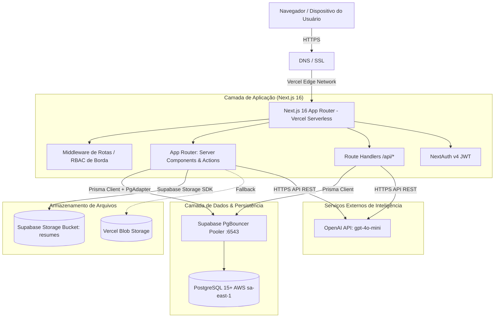

# 🗺️ 02. Mapa da Arquitetura Atual — Maître Conecta

> **Evidências:** `[CÓDIGO]`, `[ARQUITETURA]`, `[CONFIGURAÇÃO]`  
> **Data:** Setembro de 2026  

---

## 1. Visão Geral da Topologia da Aplicação

---

## 2. Mapa Completo de Rotas e Endpoints

### 2.1. Rotas Públicas
* `/`: Redireciona usuários logados com base no papel; usuários anônimos visualizam landing institucional ou login.
* `/login`: Tela de autenticação com e-mail e senha.
* `/recuperar-senha`: Solicitação de token de reset de senha.
* `/redefinir-senha/[token]`: Formulário de troca de senha com token de uso único validado no banco.
* `/carreiras/[companySlug]`: Portal público de vagas white-label por empresa parceira.
* `/carreiras/[companySlug]/[jobId]`: Detalhes da vaga aberta.
* `/carreiras/[companySlug]/[jobId]/apply`: Formulário simplificado de candidatura pública com upload de PDF.
* `/carreiras/[companySlug]/admissao/[token]`: Portal seguro do novo colaborador para envio de documentos admissionais.
* `/carreiras/[companySlug]/candidato/login`: Login para o portal do candidato.
* `/carreiras/[companySlug]/candidato/cadastro`: Auto-cadastro de candidatos.

### 2.2. Rotas Autenticadas Internas (Dashboard)
* `/(dashboard)`: Painel Executivo Global (restrito a ADMIN/SUPER_ADMIN via código, mas sem filtro de organização nas consultas).
* `/jobs`: Gestão de vagas corporativas.
* `/jobs/[id]/board`: Pipeline Kanban interativo com drag-and-drop de candidaturas.
* `/jobs/[id]/edit`: Edição de critérios, salário e knockouts da vaga.
* `/candidates`: Banco de talentos e triagem inteligente com split viewer.
* `/employees`: Conecta Pessoas (Core HR, tabela mista de HireConversion e Employee).
* `/operations`: Conecta Operações (Checklist de admissão digital e conferência documental).
* `/insights`: Conecta Insights (People Analytics e gráficos de R&S).
* `/development`: Conecta Desenvolvimento (Matriz 9-Box e PDI).
* `/learning`: Conecta Aprendizagem (LMS corporativo e catálogo de cursos).
* `/culture`: Conecta Cultura (Pesquisas de clima, eNPS e reconhecimentos).
* `/careers-hub`: Conecta Carreiras (Sucessão de cadeiras críticas e prontidão).
* `/consulting`: Conecta Consultoria (Projetos e entregáveis da Maître).
* `/clients`: Gestão multitenant das empresas clientes parceiras.
* `/clients/[id]`: Visão 360° de cliente específico.
* `/users`: Gestão de usuários internos e recrutadores.
* `/settings`: Configurações institucionais da organização e perfil do usuário.

### 2.3. Route Handlers (`/api/*`)
* `/api/auth/[...nextauth]`: Handlers do NextAuth para login, logout e sessão JWT.
* `/api/candidates`: Upsert de candidatos por recrutadores (possui falha de IDOR por email global).
* `/api/candidate/applications`: Submissão e listagem de candidaturas.
* `/api/candidate/generate-feedback`: Geração de feedback empático via OpenAI / heurística.
* `/api/documents/[id]`: Geração de signed URL temporária (15 min) para visualização de documentos.
* `/api/interviews`: Agendamento de entrevistas.
* `/api/scorecards`: Avaliações estruturadas de candidatos por entrevistadores.
* `/api/offers`: Emissão e aprovação de propostas salariais.
* `/api/organizations`: Listagem de empresas cadastradas (sem filtro de tenant - BOLA).
* `/api/parse-resume`: Endpoint de extração de currículos (PDF -> Texto -> Heurística/OpenAI).
* `/api/cron/retention`: Rotina programada de descarte/anonimização de dados LGPD.
* `/api/lgpd/dsr`: Requisições de titulares (Data Subject Rights).

---

## 3. Avaliação de Modularidade e Acoplamento

* **Diagnóstico Arquitetural:** O sistema **não é um monólito modular estrito**, mas sim um **monólito padrão do Next.js (App Router)** com acoplamento direto à camada de dados Prisma em Server Components e Server Actions.
* **Fronteiras de Domínio:** As regras de negócio de ATS, DP, Core HR e Consultoria estão dispersas entre Server Actions (`actions.ts` locais em cada pasta de rota), componentes de cliente e rotas de API, sem uma camada de serviços (`Service Layer`) ou repositórios formais isolados.
* **Dependências Circulares:** Não foram encontradas dependências circulares impeditivas de compilação, mas há dependência cruzada entre as entidades `Candidate`, `Application`, `HireConversion` e `Employee`.
