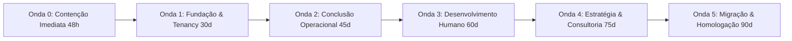

# 📋 15. Backlog de Remediação Estruturado por Ondas — Maître Conecta

> **Evidências:** `[ARQUITETURA]`, `[CÓDIGO]`, `[BANCO]`, `[SEGURANÇA]`  
> **Data:** Setembro de 2026  

---

## Estrutura de Execução em 6 Ondas Sequenciais

---

### Onda 0 — Contenção Imediata de Riscos Críticos (Primeiras 48 Horas)
*Meta: Eliminar imediatamente riscos de vazamento em massa, exposição de segredos e perda de dados sem alterar a funcionalidade do produto.*

1. **[T-01] Blindagem do Supabase Storage:**
   * Alterar bucket `resumes` para estritamente privado (`public: false`).
   * Dropar policies de `public select` e `public update` em `storage.objects`.
   * Garantir que downloads ocorram exclusivamente via URL assinada temporária gerada pelo backend.
2. **[T-02] Expurgar Segredos e Fallbacks Hardcoded:**
   * Remover strings de fallback em `src/lib/auth.ts`, `src/lib/supabase.ts`, `src/lib/resume-storage.ts` e `src/middleware.ts`.
   * Forçar falha de startup caso as variáveis de ambiente obrigatórias não estejam presentes.
3. **[T-03] Contenção Imediata de Vazamento Cross-Tenant nos Server Components:**
   * Injetar filtro `organizationId` obrigatório em `src/app/(dashboard)/insights/page.tsx`, `page.tsx`, `operations/page.tsx`, `careers-hub/page.tsx`, `consulting/page.tsx`.
   * Bloquear visualização de dados de outros tenants se o usuário logado não for `SUPER_ADMIN`.
4. **[T-04] Backup Frio Imediato de Emergência:**
   * Realizar dump completo do PostgreSQL remoto e snapshot do storage antes de qualquer alteração de código.

---

### Onda 1 — Fundação, Arquitetura e Tenancy (Dias 1 a 30)
*Meta: Estabelecer isolamento multitenant inviolável no servidor, versionamento de banco e pipeline de CI/CD.*

1. **[T-05] Criação do Histórico de Migrations do Prisma:**
   * Executar baseline de migration do schema atual (`prisma migrate dev --name baseline`).
   * Substituir `db:push` no `package.json` por `prisma migrate deploy`.
2. **[T-06] Unicidade de Candidato por Organização:**
   * Modificar modelo `Candidate` no Prisma: de `email @unique` para `@@unique([organizationId, email])`.
3. **[T-07] Middleware e Proteção Unificada de APIs:**
   * Atualizar o matcher do middleware para incluir `/api/:path*` (com exceção de rotas públicas de login e candidaturas).
   * Migrar de `middleware.ts` para a convenção `proxy.ts` do Next.js 16.
4. **[T-08] Pipeline de CI/CD (GitHub Actions):**
   * Configurar workflow automatizado executando `npm test`, `npx tsc --noEmit` e `npm run lint` em cada Pull Request.
5. **[T-09] Suíte de Testes Negativos de Isolamento Multitenant:**
   * Criar testes automatizados comprovando que Usuário da Org A recebe `403 Forbidden` ao tentar acessar dados da Org B.

---

### Onda 2 — Conclusão Operacional (Dias 31 a 50)
*Meta: Finalizar os módulos operacionais de RH, DP e Recrutamento.*

1. **[T-10] Conecta Talentos:**
   * Aperfeiçoar pipeline de etapas customizadas por vaga.
   * Rastreabilidade de candidatos com histórico de candidaturas por empresa.
2. **[T-11] Conecta Pessoas (Core HR Completo):**
   * Desacoplar totalmente a dependência de `HireConversion` para leitura de colaboradores.
   * Criar modelos para: histórico funcional (mudanças de cargo/salário), controle de férias e afastamentos médicos.
3. **[T-12] Conecta Operações (DP & Offboarding):**
   * Criar fluxo de checklist de desligamento (rescisão) e histórico de termos admissionais.

---

### Onda 3 — Desenvolvimento Humano (Dias 51 a 65)
*Meta: Estruturar DHO, LMS e Clima Organizacional.*

1. **[T-13] Conecta Desenvolvimento:**
   * Ciclos formais de avaliação com autoavaliação e avaliação do gestor (90° e 180°).
   * Matriz de metas vinculadas ao PDI.
2. **[T-14] Conecta Aprendizagem:**
   * Gestão de turmas e controle de frequência.
   * Questionários de fixação pós-curso com nota de aprovação para emissão de certificado.
3. **[T-15] Conecta Cultura:**
   * Regra de anonimato estrito (ocultar respostas de segmentos com menos de 5 respondentes).
   * Módulo de Planos de Ação (Action Plans) derivados dos resultados do eNPS.

---

### Onda 4 — Estratégia e Consultoria (Dias 66 a 80)
*Meta: People Analytics avançado, Sucessão e BPO.*

1. **[T-16] Conecta Insights:**
   * Cálculo real de turnover e absenteísmo com base no histórico de admissões e desligamentos.
2. **[T-17] Conecta Carreiras:**
   * Portal interno de candidaturas com validação de elegibilidade e trilhas de carreira.
3. **[T-18] Conecta Consultoria:**
   * Apontamento de horas (timesheet) e portal do cliente corporativo para aprovação de entregáveis.

---

### Onda 5 — Migração e Homologação Final (Dias 81 a 90)
*Meta: Migração segura, cutover, rollback testado e homologação final.*

1. **[T-19] Ensaio de Migração em Ambiente Espelho (Staging):**
   * Replicação de dados para a infraestrutura de destino.
   * Testes ponta a ponta em todas as 16 jornadas críticas.
2. **[T-20] Validação de Rollback e Procedimento de Contingência:**
   * Ensaio de retorno com tempo de indisponibilidade medido (< 30 minutos).
3. **[T-21] Cutover Oficial de Produção e Homologação dos Gates G8 e G9.**
