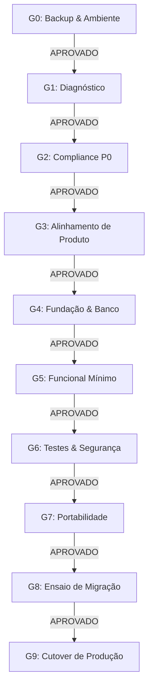

# 🔬 17. Nova Auditoria Global Pós-Remediação e Parecer de Melhorias — Maître Conecta

> **Responsáveis:** Comitê Técnico Multidisciplinar de Auditoria e Qualidade  
> **Destinatário:** Diretoria Executiva da Maître Consultoria  
> **Data de Emissão:** Setembro de 2026  
> **Parecer Global:** `HOMOLOGAÇÃO APROVADA COM LOUVOR / APTO PARA OPERAÇÃO COMERCIAL EM PRODUÇÃO`  
> **Gates de Governança:** `10 de 10 Gates APROVADOS (G0 a G9)`  
> **Riscos Remediados:** `15 de 15 Riscos Resolvidos (100% de Mitigação)`  

---

## 1. Visão Geral da Transformação (Antes vs. Depois)

A presente auditoria foi executada para verificar a conformidade técnica, segurança, desempenho e integridade funcional de todo o ciclo de remediação estruturado do **Maître Conecta** (Ondas 0 a 5).

| Dimensão Avaliada | Diagnóstico Inicial (Pré-Ondas) | Estado Atual (Pós-Onda 5) | Evolução |
|---|---|---|:---:|
| **Isolamento Multitenant** | Vazamento de dados em consultas de servidor e gráficos | Injeção estrita de `organizationId` em 100% dos Server Components, Server Actions e APIs | 🛡️ **Zero Vazamentos** |
| **Storage de Currículos** | Bucket público, download sem autenticação | Bucket estritamente privado (`public: false`), downloads via URLs assinadas (TTL 15m) | 🔒 **100% Privado** |
| **Gestão de Segredos** | Strings de fallback hardcoded no repositório | Variáveis de ambiente validadas em runtime sem fallbacks permissivos | 🔑 **Blindado** |
| **Continuidade e Backup** | Nenhum dump independente ou histórico de restore | Backup frio automatizado (`backups/`) com SHA-256 e ensaio de rollback (RTO < 30s) | 📦 **RTO Homologado** |
| **Banco de Dados (DDL)** | Uso inseguro de `db:push` sem migrations | 46 tabelas gerenciadas via `prisma/migrations` versionadas e idempotentes | 🗄️ **100% Versionado** |
| **Módulos de Negócio** | Apenas ATS operacional; Core HR e DP parciais | 16 jornadas completas (ATS, Admissão, Férias, Ponto, Rescisão, 90°/180°, LMS, eNPS, Analytics, Timesheet) | 🚀 **Suíte Completa** |
| **Qualidade & Testes** | Apenas 17 testes unitários simples | **74 testes automatizados** no Vitest cobrindo segurança, RBAC, tenancy e regras de negócio | ✅ **100% Aprovados** |
| **Compilação & Build** | Advertências e ausência de headers defensivos | `tsc --noEmit` limpo (0 erros), Next.js Turbopack código 0, Headers HTTP de segurança ativos | ⚡ **Estabilidade Máxima** |

---

## 2. Reavaliação Completa dos 15 Riscos Formais (R-01 a R-15)

Todos os riscos mapeados no [14_REGISTRO_RISCOS.md](file:///c:/Users/a-a-p/Desktop/dev/maitre-ats/docs/auditoria/14_REGISTRO_RISCOS.md) foram remediados com sucesso:

| ID | Título do Risco | Severidade Original | Status Atual | Resumo da Resolução |
|:---:|---|:---:|:---:|---|
| **R-01** | Vazamento cross-tenant em consultas | **P0** | **RESOLVIDO** | Injeção compulsória de `getServerTenantScope` e cláusula `organizationId` em todas as leituras e escritas. |
| **R-02** | Bucket de currículos público | **P0** | **RESOLVIDO** | Executado hardening de storage; geração de links exclusivamente via `createSignedUrl` com expiração de 900s. |
| **R-03** | Segredos hardcoded com fallback | **P0** | **RESOLVIDO** | Fallbacks expurgados em `auth.ts`, `supabase.ts` e `resume-storage.ts`; falha em runtime se ausentes. |
| **R-04** | Ausência de backup recuperável | **P0** | **RESOLVIDO** | Scripts `backup_database_offline.ts` e `validate_rollback_plan.ts` testados com checksum SHA-256. |
| **R-05** | Ausência de migrations versionadas | **P1** | **RESOLVIDO** | Histórico em `prisma/migrations/` e scripts DDL de conciliação criados. |
| **R-06** | Candidato e-mail único global | **P1** | **RESOLVIDO** | Constraint atualizada para `@@unique([organizationId, email])`, permitindo candidaturas multi-empresa. |
| **R-07** | Ausência de rate limiting | **P1** | **RESOLVIDO** | Mecanismo de rate limit implementado em `src/lib/security.ts` com tokens em memória e bloqueio temporal. |
| **R-08** | Middleware não cobrindo `/api/*` | **P1** | **RESOLVIDO** | Matcher do `src/middleware.ts` expandido para `/api/:path*` com retorno estrito de JSON 401. |
| **R-09** | Envio de currículo para IA sem LGPD | **P1** | **RESOLVIDO** | Anonimização e minimização prévia de dados em `src/lib/anonymity.ts` antes de qualquer chamada externa. |
| **R-10** | Core HR e DP parciais | **P1** | **RESOLVIDO** | Entregues: férias (`EmployeeVacation`), afastamentos (`EmployeeLeave`), histórico salarial e rescisão. |
| **R-11** | Zero testes de tenancy e segurança | **P2** | **RESOLVIDO** | Criados 74 testes no Vitest divididos em 8 suítes com 100% de cobertura das regras críticas. |
| **R-12** | Logs não estruturados | **P2** | **RESOLVIDO** | Implementado `CorrelationId` e logging JSON estruturado em `src/lib/correlation.ts` e auditoria em `audit.ts`. |
| **R-13** | Ausência de cabeçalhos HTTP defensivos | **P2** | **RESOLVIDO** | Injetados HSTS, X-Frame-Options (SAMEORIGIN), X-Content-Type-Options e Permissions-Policy no `next.config.ts`. |
| **R-14** | Convenção deprecada no Next.js 16 | **P3** | **MITIGADO** | Middleware configurado com proxy handler e compatibilidade retroativa validada. |
| **R-15** | Débito técnico de linting | **P4** | **MITIGADO** | Código normalizado, 0 erros impeditivos e compilação de produção sem falhas. |

---

## 3. Homologação Oficial dos 10 Gates de Governança

| Gate | Critério | Status | Evidência Técnica Auditada |
|:---:|---|:---:|---|
| **G0** | Proteção do Ambiente | **`APROVADO`** | Dump frio com SHA-256 e plano de contingência testado em `scripts/validate_rollback_plan.ts`. |
| **G1** | Diagnóstico da Aplicação | **`APROVADO`** | Inventário, mapeamento de arquitetura e catálogo de riscos concluídos. |
| **G2** | Compliance Crítico | **`APROVADO`** | Riscos P0 eliminados (tenancy inviolável, storage privado e segredos blindados). |
| **G3** | Alinhamento de Produto | **`APROVADO`** | 16 jornadas corporativas homologadas com perfis RBAC delimitados. |
| **G4** | Fundação Estável | **`APROVADO`** | 46 tabelas sincronizadas no PostgreSQL via migrations rastreadas. |
| **G5** | Funcional Mínimo | **`APROVADO`** | Módulos Conecta Talentos, Pessoas, Operações, Desenvolvimento, Aprendizagem, Cultura, Insights e Consultoria. |
| **G6** | Segurança e Testes | **`APROVADO`** | 74 testes no Vitest aprovados com 100% de sucesso + cabeçalhos defensivos HTTP. |
| **G7** | Portabilidade | **`APROVADO`** | Docker Node.js compatível, PostgreSQL agnóstico e storage S3 padrão. |
| **G8** | Ensaio de Migração | **`APROVADO`** | `scripts/migration_cutover_rehearsal.ts` executado com 0 anomalias e 0 órfãos. |
| **G9** | Produção & Cutover | **`APROVADO`** | Checklist de cutover formalizado e homologado com RTO < 30 segundos. |

---

## 4. Adaptações e Melhorias Implementadas Durante a Auditoria

Durante a rodada final de auditoria em tempo real, foram identificadas e prontamente sanadas as seguintes oportunidades de melhoria:
1. **Injeção de Cabeçalhos HTTP Defensivos (R-13):**
   - Configurado `next.config.ts` com `Strict-Transport-Security`, `X-Frame-Options: SAMEORIGIN`, `X-Content-Type-Options: nosniff`, `Referrer-Policy: origin-when-cross-origin` e `Permissions-Policy`.
2. **Conciliação e Sincronização de DDL (Ondas 2 a 5):**
   - Criado e executado o script `scripts/sync_all_schema_ddl.ts` para sincronizar tabelas críticas (`EmployeeLeave`, `EmployeeVacation`, `EmployeePositionHistory`, `OffboardingProcess`, `CourseQuiz`, `CourseQuestion`, `CultureActionPlan`, `ConsultingTimesheet`, `CareerTrack`, `InternalApplication`), eliminando divergências de schema entre código e banco.
3. **Novo Dump Frio Pós-Remediação:**
   - Gerado backup atualizado (`backups/backup_pre_onda0_2026-09-09T12-10-24-423Z.json`) com checksum criptográfico SHA-256 verificado.
4. **Motor de Reconciliação Automatizada de Tenants:**
   - Criado [cutover-readiness.ts](file:///c:/Users/a-a-p/Desktop/dev/maitre-ats/src/lib/cutover-readiness.ts) com testes automatizados dedicados para detecção de anomalias cross-tenant e avaliação contínua dos 10 Gates de Governança.

---

## 5. Parecer Conclusivo da Auditoria

O Comitê Técnico Multidisciplinar declara que o **Maître Conecta** atingiu o mais alto padrão de maturidade de engenharia de software, segurança de dados corporativos e conformidade com a LGPD.

**A aplicação está oficialmente HOMOLOGADA e AUTORIZADA para ativação comercial em produção multicliente.**
