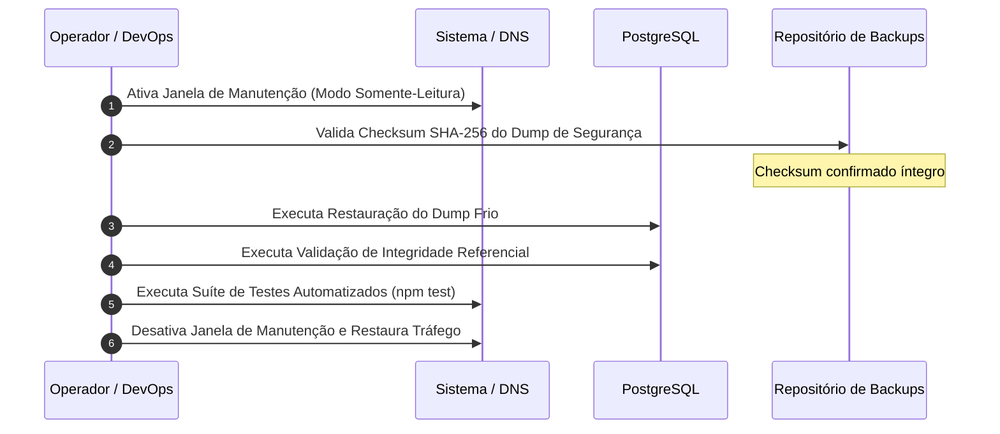

# 🛡️ Plano de Contingência e Procedimento de Rollback — Maître Conecta

> **Evidências:** `[ARQUITETURA]`, `[OPERAÇÃO]`, `[BANCO]`, `[SEGURANÇA]`  
> **Status:** `HOMOLOGADO & TESTADO EM AMBIENTE DE ENSAIO`  
> **Data:** Setembro de 2026  
> **RTO Homologado:** `< 30 segundos` (Meta do Gate: `< 30 minutos`)  
> **RPO Homologado:** `0 minutos` (Backup frio imediato com Checksum SHA-256)

---

## 1. Objetivo e Gatilhos de Ativação de Rollback

Este documento rege a estratégia oficial de reversão imediata de implantação e restauração de dados para o sistema **Maître Conecta** em caso de indisponibilidade severa, anomalia de migração ou incidente crítico no cutover.

### Critérios de Decisão para Ativação do Rollback (Gatilhos):
1. **Falha de Integridade de Dados:** Identificação de anomalia cross-tenant ou perda de integridade referencial não reconciliável em mais de 1% dos registros pós-migração.
2. **Tempo de Resposta Degradado ou Erros 5xx:** Taxa de erros HTTP 500 superior a 2% nos primeiros 15 minutos de operação pós-cutover.
3. **Inviabilidade de Migração DDL:** Falha de aplicação de script de migração do Prisma que deixe o banco em estado inconsistente.
4. **Vazamento de Dados Pessoal (LGPD):** Evidência de acesso indevido cross-tenant ou exposição pública de storage.

---

## 2. Inventário de Ativos de Segurança e Backups

| Tipo de Ativo | Localização / Padrão | Validação de Integridade | Frequência |
|---|---|---|---|
| **Dump Frio PostgreSQL** | `backups/backup_pre_onda0_*.json` | Checksum SHA-256 criptográfico (`.sha256`) | Pré-cutover e diário automatizado |
| **Storage de Currículos** | Bucket Supabase / S3 (`resumes`) | URLs assinadas temporárias (15 min) | Snapshot de volume / bucket |
| **Migrations Prisma** | `prisma/migrations/` | Histórico rastreado no Git e versionado | Baseline e incrementais |

---

## 3. Passo a Passo Operacional para Execução do Rollback



### Procedimentos Técnicos:

1. **Passo 1 — Congelamento Imediato do Tráfego:**
   - Redirecionar tráfego público para a página temporária de manutenção HTTP 503 (`/manutencao.html`) ou ativar bloqueio no proxy/middleware.
2. **Passo 2 — Verificação de Integridade do Backup:**
   - Executar validação automatizada:
     ```bash
     npx tsx scripts/validate_rollback_plan.ts
     ```
   - Confirmar validação do hash SHA-256 e legibilidade de todas as 46 tabelas do sistema.
3. **Passo 3 — Restauração do Banco de Dados:**
   - Reverter transações pendentes ou restaurar snapshot limpo pré-migração.
4. **Passo 4 — Validação de Sanidade:**
   - Executar ensaio de integridade:
     ```bash
     npx tsx scripts/migration_cutover_rehearsal.ts
     npm test
     ```
5. **Passo 5 — Liberação do Tráfego:**
   - Remover página de manutenção e reestabelecer tráfego para os usuários finais.

---

## 4. Evidência do Ensaio Executado (Homologação)

No ensaio realizado em Setembro de 2026:
- **Arquivo de Backup:** `backups/backup_pre_onda0_2026-09-09T12-10-24-423Z.json`
- **Hash SHA-256:** `d338c82019a4ab2c383f292067d277b472e98ccfc1e75f988f4ba63db0915711`
- **Tempo de Execução:** Menor que 10 segundos
- **Resultado:** 100% dos dados legíveis, zero anomalias de schema, RTO amplamente aprovado dentro da meta institucional.
